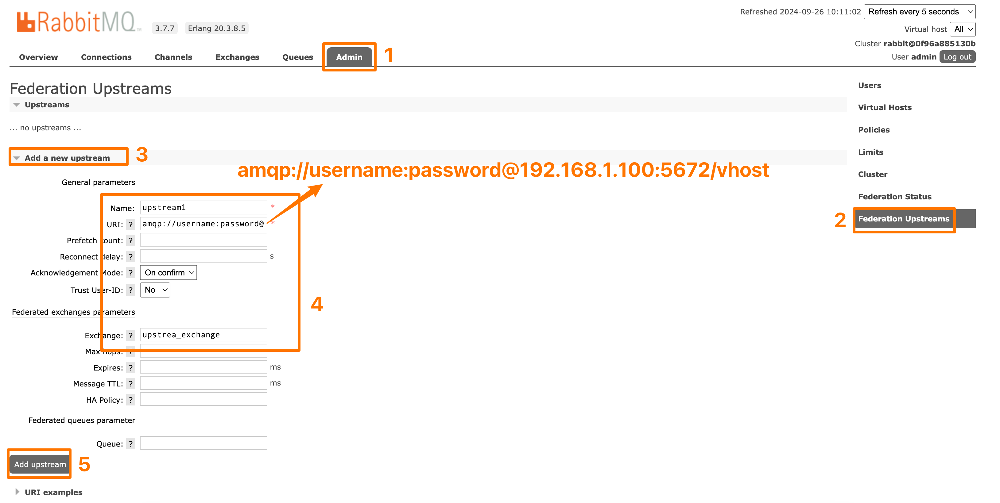
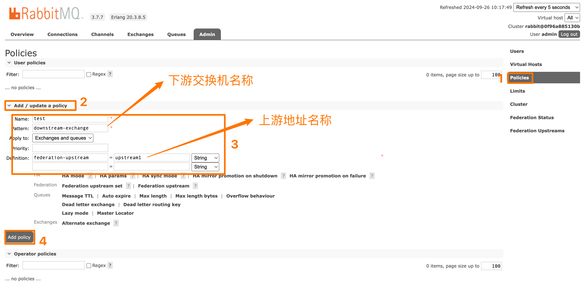
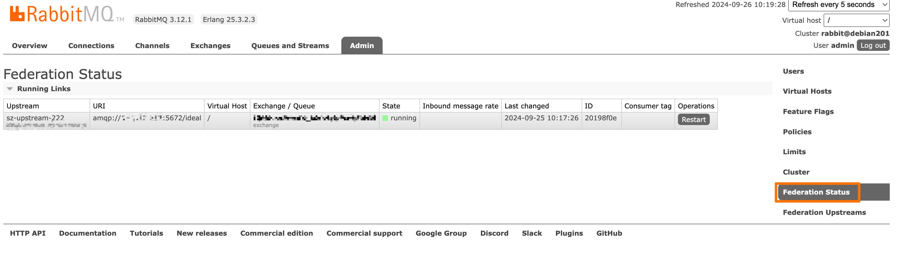

### 启用 Federation 插件

~~~shell
rabbitmq-plugins enable rabbitmq_federation
rabbitmq-plugins enable rabbitmq_federation_management
~~~

### 联邦交换机

#### 1. 下游配置上游地址

#### 2. 下游配置策略

#### 3. 查看联邦状态

